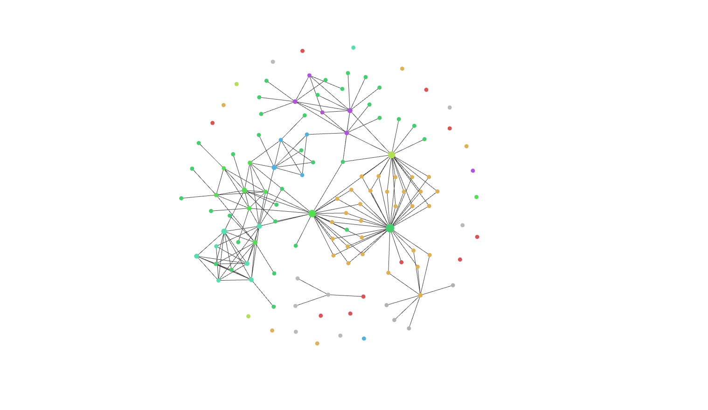

# Scientific Notes
[](https://github.com/Booodaness/Scientific-Notes/commits/main) [](https://creativecommons.org/licenses/by-nc-sa/4.0/)

## About


`Scientific-Notes` is a collection of collaborative, open-source notes on various topics in mathematical physics, made using [Obsidian](https://obsidian.md/). The repository is aimed to be a knowledge base of ideas in the subjects, accessible to everyone for reference and experimentation. It is not a Wikipedia, although it does adopt some of its features, such as [hyperlinks](https://help.obsidian.md/How+to/Internal+link) and [atomicity](https://neuron.zettel.page/atomic).

For screenshots of the project, see [screenshots.md](screenshots.md).

## Viewing locally
Firstly, [download](https://obsidian.md/download) Obsidian unless you have, already. After following the steps below, install Obsidian community plugins as described in [PLUGINS.md](PLUGINS.md).

### Without Git
1. Click the green 'Code' button at the top of this repository's [homepage](https://github.com/Booodaness/Scientific-Notes) and navigate to '[Download ZIP](https://github.com/Booodaness/Scientific-Notes/archive/refs/heads/main.zip)'.
2. Extract the ZIP.
3. Rename `Scientific-Notes-main/Scientific-Notes-main` to `Scientific-Notes-main/Scientific-Notes`.
4. Open `Scientific-Notes-main/Scientific-Notes` as a new Obsidian [vault](https://help.obsidian.md/How+to/Working+with+multiple+vaults).

### With Git
1. Make sure you have [Git](https://git-scm.com/) installed on your system. Open Git bash and clone this repository by successively running:

```
cd <parent_directory>
```

```
git clone https://github.com/Booodaness/Scientific-Notes
```

2. Open `<parent_directory>/Scientific-Notes` as a new Obsidian [vault](https://help.obsidian.md/How+to/Working+with+multiple+vaults).

## Pools
The entire project is separated into modules called pools. There are two kinds of pools  — personal pools and the common pool. Every author maintains and owns a personal pool with the same name as their GitHub username. The common pool, on the other hand, has fully collaborative notes, in the directory `_Common`. There is a second personal pool authors can optionally use, `_Local`. As it is included in the `.gitignore` file, all its contents are stored only locally in the respective author's systems. This feature is for keeping private notes, while making them locally linkable to the public ones. However, we recommend authors to maintain as many public notes as possible since it is the primary aim of this project. 

Authors merge commits using pull requests and conversations. These must be reviewed by the personal pool owners/common pool contributors whose code has been modified. We keep track of the code owned by authors, in the [CODEOWNERS](https://docs.github.com/en/repositories/managing-your-repositorys-settings-and-features/customizing-your-repository/about-code-owners) file `.github/CODEOWNERS`.

Each pool has the following layout:

```
.
└── <Pool_name>
    │
    ├── _Assets           (Non-markdown files)
    │   ├── Desmos        (Cached Desmos graphs)
    │   ├── Excalidraw    (Diagrams made with 'Excalidraw' plugin)
    │   ├── Images        (Images used in articles)
    │   ├── Templates     (Templates made with 'Templates' plugin)
    │   └── ...           (Other data collections)
    │
    ├── _Uncategorized    (Uncategorized notes)
    │   ├── _to-do        (Kanban)
    │   ├── article-1     (e.g. 'quantum-mechanics.md')
    │   └── ...           (Other articles)
    │
    ├── <Topic 1>         (e.g. 'Field Theory')
    │   ├── _contents     (Contents page linking to articles on Topic 1)
    │   ├── _to-do        (Kanban for Topic 1)
    │   ├── article-1     (e.g. 'principle-of-stationary-action.md')
    │   └── ...           (Other articles)
    │
    ├── ...               (Other Topics)
    │
    └── _to-do            (Kanban for entire pool)
```

The exclamation marks before folder/file names indicate that they are contextually different from the main content of the folders/files in their parent directory. For example, `<Pool_name>/<Topic_1>` is primarily for articles related to the topic, so extra files such as `_contents` and `_to-do` have the `_` prefix.

## Directory structure
The complete repository has the structure:

```
.
│
├── _Common        (Common pool)
│
├── _Local         (Local personal pool)
│
├── .github        (GitHub config files)
│
├── <Author_1>     (Personal pool for Author_1)
│
├── ...            (Personal pools for more authors)
│
├── .gitattributes (Attributes for files with listed patterns)
│
├── .gitignore     (List of files untracked by git)
│
├── LICENCE.md     (Licence statement)
│
├── PLUGINS.md     (Plugins used)
│
├── RESOURCES.md   (Resources for authors)
│
└── README.md      (Documentation)
```

## Contributing
(Resources for contributors are listed in [RESOURCES.md](RESOURCES.md)).

Firstly, [fork this repository](https://github.com/Booodaness/Scientific-Notes/fork) and follow the steps for [viewing locally](#viewing-locally), but for the fork instead of the original repository. Now, for:

### Adding personal notes
1. Ensure that the parent directory of your notes has the layout of a [pool](#pools).
2. Place your pool in the root.
3. Start a pull request.

### Editing the common pool
1. Edit your fork as desired.
2. Verify that the structure of the common pool has not been altered.
3. Start a pull request.
4. Document your edits in the review page of the pull request.

After completing the above steps, your contributions will be considered for merging into the project. If an author maintains their notes regularly, they will be invited to become a collaborator.

Last but not the least, happy reading/writing! :)
