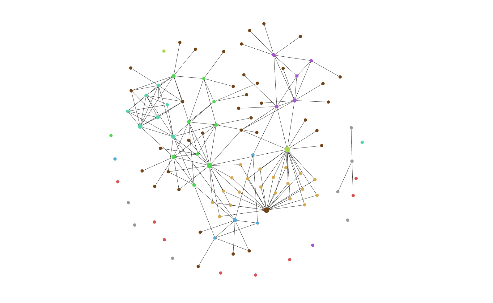

# Scientific Notes
[](https://github.com/Booodaness/Scientific-Notes/commits/master) [](https://creativecommons.org/licenses/by-nc-sa/4.0/)

## About


`Scientific-Notes` is a collection of collaborative, open-source notes on various topics in mathematical physics, physics and mathematics. The project is aimed to be a knowledge base of ideas in the subjects, accessible to everyone for reading and playing around with. It tries to resolve some of the limitations of traditional wikis by:

- Utilizing the power of [Obsidian](https://obsidian.md/) through native features and plugins
- Being flexible in terms of writing style, while also,
- Borrowing wiki-like features (such as [hyperlinks](https://help.obsidian.md/How+to/Internal+link) and [atomic notes](https://neuron.zettel.page/atomic)) for smooth collaboration
- Containing unique expositions to the explored topics, for maximum reader benefit

Structurally, this repository is an Obsidian [vault](https://help.obsidian.md/How+to/Working+with+multiple+vaults). For screenshots, see [screenshots.md](!Common/!Assets/Presentations/screenshots.md).

## Viewing locally
Firstly, [download](https://obsidian.md/download) Obsidian unless you have, already.

### Without Git
1. Click the green 'Code' button at the top of this repository's [homepage](https://github.com/Booodaness/Scientific-Notes) and navigate to '[Download ZIP](https://github.com/Booodaness/Scientific-Notes/archive/refs/heads/master.zip)'.
2. Extract the ZIP.
3. Rename `Scientific-Notes-master/Scientific-Notes-master` to `Scientific-Notes-master/Scientific-Notes`.
4. Open `Scientific-Notes-master/Scientific-Notes` as a new [Obsidian vault](https://help.obsidian.md/Getting+started/Create+a+vault).
5. Install Obsidian community plugins as described in [PLUGINS.md](PLUGINS.md).

### With Git
1. Make sure you have [Git](https://git-scm.com/) installed on your system. Open Git bash and clone this repository by successively running:

```
cd <parent_directory>
```

```
git clone https://github.com/Booodaness/Scientific-Notes
```

2. Open `<parent_directory>/Scientific-Notes` as a new [Obsidian vault](https://help.obsidian.md/Getting+started/Create+a+vault).
3. Install Obsidian community plugins as described in [PLUGINS.md](PLUGINS.md).

## Pools
Each collaborator can directly edit content in root directories called pools. There are two kinds of pools  — individual pools and the common pool. Every author maintains an individual pool with the same name as their GitHub username. There is a second individual pool authors can optionally use, `!Local`. As it is included in the `.gitignore` file, all its contents are stored only locally in the respective author's systems. This feature is for keeping private notes, while making them locally linkable to the public ones. However, we recommend authors to maintain the public notes as much as possible since it is the primary aim of this project. Lastly, we have the common pool with fully collaborative notes, in the directory `!Common`.

When authors want to suggest edits to other authors' pools, they must [fork the project](https://github.com/Booodaness/Scientific-Notes/fork) , modify accordingly and start a pull request. After optional discussion in the request's review page, the changed pool's author (or the project's owner) may merge the pull request (or decline to do so).

Each pool has the following layout:

```
.
└── <Pool_name> 
    │
    ├── !Assets           (Non-markdown files)
    │   ├── Desmos        (Cached Desmos graphs)
    │   ├── Excalidraw    (Diagrams made with 'Excalidraw' plugin)
    │   ├── Images        (Images used in articles)
    │   ├── Templates     (Templates made with 'Templates' plugin)
    │   └── ...           (Other data collections)
    │
    ├── !Uncategorized    (Uncategorized notes)
    │   ├── !to-do        (Kanban)
    │   ├── article-1     (e.g. 'quantum-mechanics.md')
    │   └── ...           (Other articles)
    │
    ├── <Topic 1>         (e.g. 'Field Theory')
    │   ├── !contents     (Contents page linking to articles on Topic 1)
    │   ├── !to-do        (Kanban for Topic 1)
    │   ├── article-1     (e.g. 'principle-of-stationary-action.md')
    │   └── ...           (Other articles)
    │
    ├── ...               (Other Topics)
    │
    └── !to-do            (Kanban for entire pool)
```

The exclamation marks before folder/file names indicate that they are contextually different from the main content of the folders/files in their parent directory. For example, `<Pool_name>/<Topic_1>` is primarily for articles related to the topic, so extra files such as `!start-here` and `!to-do` have the `!` prefix.

## Directory structure
The complete repository has the structure:

```
.
│
├── !Common    (Common pool)
│
├── !Local     (Local individual pool)
│
├── <Author_1> (Individual pool for Author_1)
│
├── ...        (Other individual pools)
│
├── LICENCE.md (Licence statement)
│
├── plugins.md (Plugins used)
│
└── README.md  (Documentation)
```

## Contributing
(Resources for contributors are listed in [RESOURCES.md](RESOURCES.md)).

Firstly, [fork this repository](https://github.com/Booodaness/Scientific-Notes/fork) and follow the steps for [viewing locally](#viewing-locally), but for the fork instead of the original repository. Now, for:

### Adding personal notes
1. Ensure that the parent directory of your notes has the layout of a [pool](#pools).
2. Place your pool in the root.
3. Start a pull request.

### Editing the common pool
1. Edit your fork as desired.
2. Verify that the structure of the common pool has not been altered.
3. Start a pull request.
4. Document your edits in the review page of the pull request.

After completing the above steps, your contributions will be considered for merging into the project. If an author maintains their notes regularly, they will be invited to become a collaborator, accepting which allows them to directly push their writings to the project.

Last but not the least, happy reading/writing! :)


